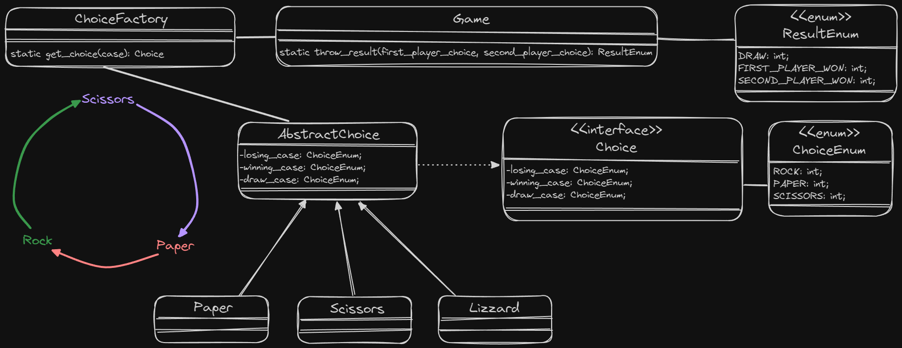
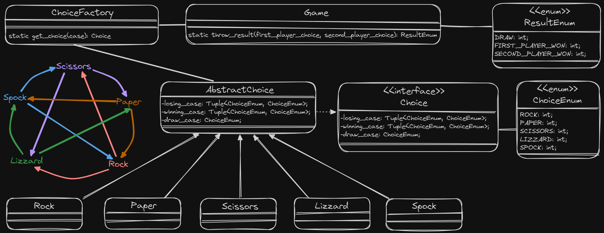

# Rock, Paper, Scissors, Lizzard, Spock Project

This project aims to implement an extended version of the classic game of Rock, Paper, Scissors, that includes two additional elements: Lizard and Spock. It utilizes Python for the game logic and pytest for unit tests to ensure the functionality is correct.

## Traditional Rock, Paper, Scissors

### Context
Rock, Paper, Scissors is a popular hand game usually played between two people. The game has three possible outcomes: a draw, where both players choose the same item, or a win for one player and a loss for the other. Each of the three basic moves (rock, paper, and scissors) can defeat one of the other two moves while being defeated by the other.

### Rules
- Rock crushes Scissors
- Scissors cuts Paper
- Paper covers Rock

### Diagram

## Rock, Paper, Scissors, Lizard, Spock

### Context
The extension of the classic game adds two additional moves, Lizard and Spock, making the game more nuanced and strategic. The rules are expanded to accommodate these new options.

### Rules
- Rock crushes Scissors
- Scissors cuts Paper
- Paper covers Rock
- Rock crushes Lizard
- Lizard poisons Spock
- Spock smashes Scissors
- Scissors decapitates Lizard
- Lizard eats Paper
- Paper disproves Spock
- Spock vaporizes Rock

### Diagram

## How to Run

To play the game, run the following command:

python -m src.app

To run unit tests, use the following command:

python -m pytest